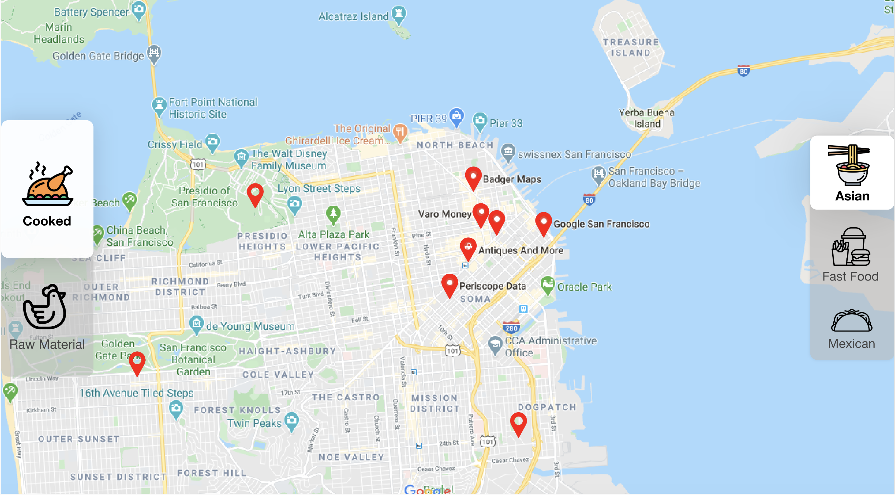
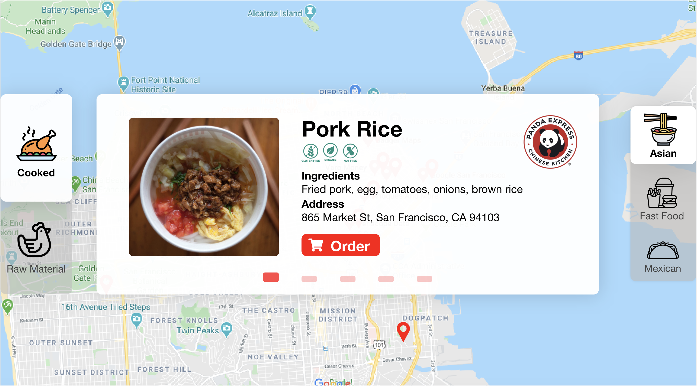
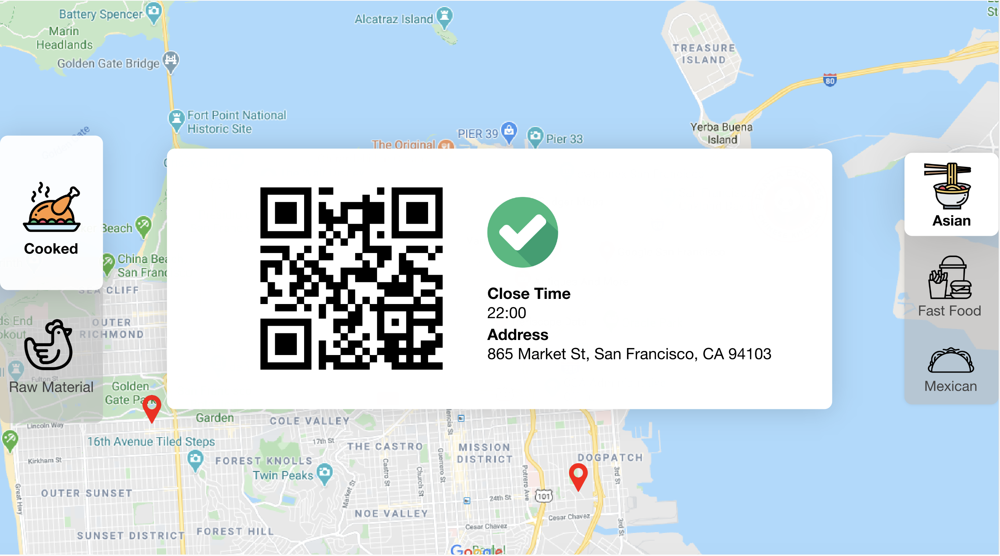

# TomTomChallenge

## About

Solve community food waste in a social positive TomTom mapping challenge at the DeveloperWeek Hackathon.

Over 1/3 of the food produced globally every year is thrown away, making this a huge societal and environmental impact. 

Use [mapbox](https://www.mapbox.com/) api.

## Install

see reuqirements.

## Usage

    python3 manage.py runserver

## Expect Output
Step 1 (Current status 🌟):

Step 2:

Step 3:

